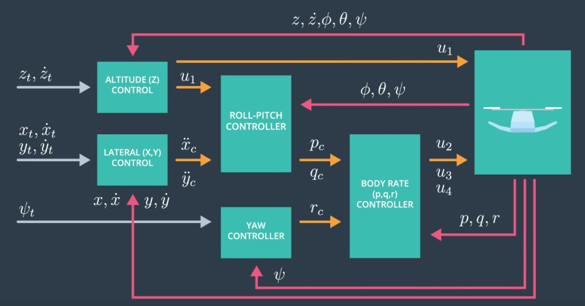
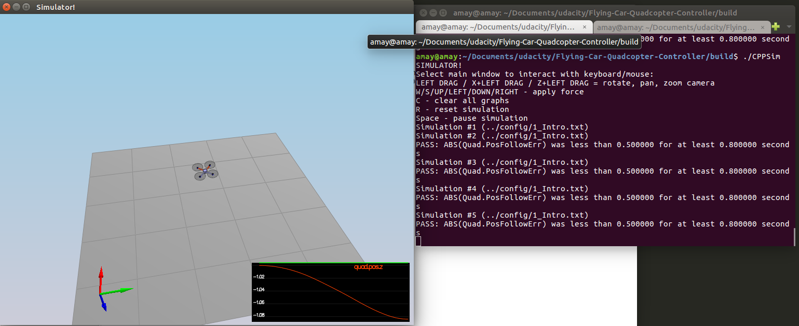
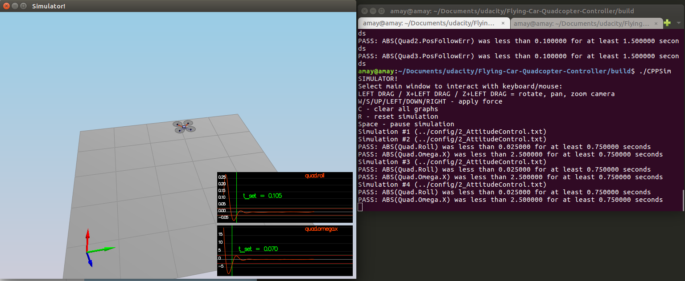
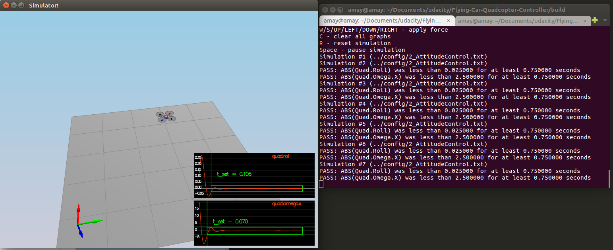
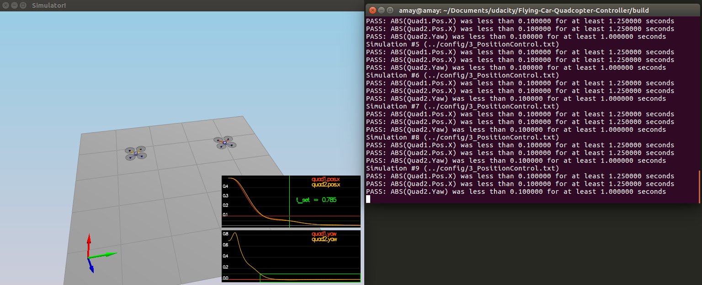
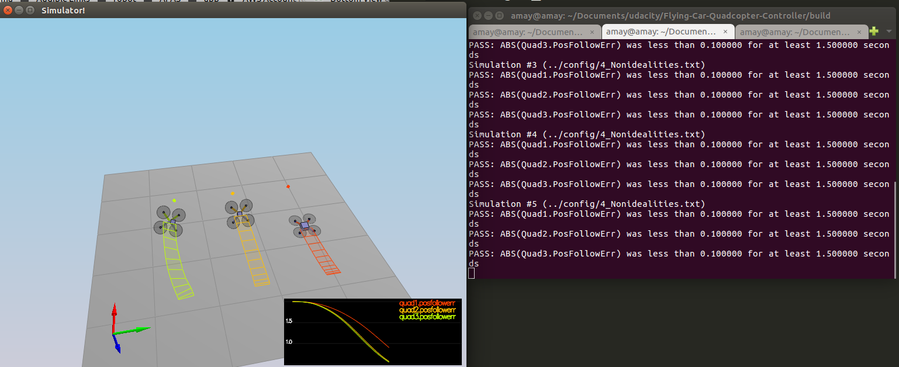
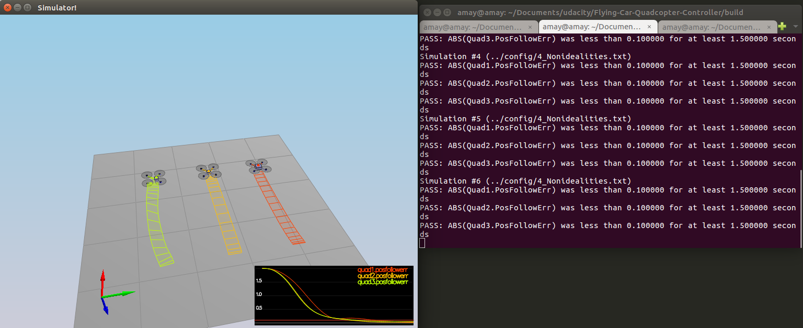

## Project: 3D Control for Quadcopter

---


# Required Steps for a Passing Submission:
1. Load the simulator and run different scenarios by putting ../config/<scenario.txt> name in the config/LastScenario.txt file.
1. Implement body rate control.
2. Implement roll pitch control.
3. Implement altitude controller.
4. mplement lateral position control.
5. Implement yaw control.
6. Implement calculating the motor commands given commanded thrust and moments.
7. Write it up.
8. Congratulations!  Your Done!

## [Rubric](https://review.udacity.com/#!/rubrics/1534/view) Points
### Here I will consider the rubric points individually and describe how I addressed each point in my implementation.  

---
### Writeup / README

#### 1. Provide a Writeup / README that includes all the rubric points and how you addressed each one.  You can submit your writeup as markdown or pdf.  

You're reading it! Below I describe how I addressed each rubric point and where in my code each point is handled.

#### 1. Explain this project.

This projec is to demonstrate basic vehicle control architecture and a full 3D cascaded control. In this case the vehicle is a quadcopter which means we can go up or down as well. The rubric points of this project can be found in the following files:

[QuadControlParams.txt](./config/QuadControlParams.txt): This file contains the configuration for the controller.

[QuadControl.cpp](./src/QuadControl.cpp): This is where we use the configuration and tune the parameters to control the drone. All the rubric points for this project can be convered in this C++ code. I have implemented Body Rate Control, Roll Pitch Control, Altitude Control, Lateral Position control and Yaw Control in QuadControl.cpp.

The 3D Control architecture for a quadcopter can be illustrated in the following image:




#### 2. Explain Scenario 1.

This is just a test scenario to see if all the initial development setup is correctly installed and configured.

```
QuadControlParams.Mass = 0.50 kg
QuadControlParams.Mass * 9.81 / 4
```



#### 3. Explain Scenario 2.

This scenario is to demonstrate AttitudeControl. The `GenerateMotorCommands()` needs to be implemented first to make this work; It converts the desired 3-axis moment and collective thrust command to individual motor thrust commands. We the have to implement the body-rate-control and roll-pitch-controller and tune the parameters. 

Note while observing the equations the z axis is inverted that is why the moment on z is taken as a negative value.

The parameters and equations are defined here:

`f0`     : thrust of the up-left propeller with clockwise rotation.
`f1`     : thrust of the up-right propeller with counterclockwise rotation.
`f2`     : thrust of the down-left propeller with counterclockwise rotation.
`f3`     : thrust of the down-right propeller with clockwise rotation.
τ(x)     : moment in direction x.
τ(y)     : moment in direction y.
τ(z)     : moment in direction z.
kappa    : drag/thrust ratio.
L        : drone arm length.
l        : drone arm length over square root of two.
b(x)     : current attitude of the drone in x direction.
b(y)     : current attitude of the drone in y direction.
bxCmd    : current attitude command of the drone in x direction.
byCmd    : current attitude command of the drone in y direction.
bxDotCmd : current attitude commanded rate of bx.
byDotCmd : current attitude commanded rate of bx.

```
f_rot_x =  f0 - f1 + f2 - f3
f_rot_y =  f0 + f1 - f2 - f3
f_rot_z = -f0 + f1 + f2 - f3
f_total =  f0 + f1 + f2 + f3
```

The rotation thrusts can be calculated using this equations:

```
l = L / sqrt(2);         
f_total = collectiveThrustCommand;
f_rot_x = τ(x) / l
f_rot_y = τ(y) / l
f_rot_z = τ(z) / kappa;
```

Next I have implemented the `BodyRateControl()` method applying a P controller and the moments of inertia. In this function the kpPQR parameter needs to be tuned to stop the drone from toppling downwards.

```
pqrDotCmd = kpPQR * (pqrCmd - pqr);
momentCmd = V3F(Ixx, Iyy, Izz) * pqrDotCmd;
```

We then move on to the RollPitchControl method. We need to apply a P controller to the elements R13 and R23 of the [rotation matrix](https://en.wikipedia.org/wiki/Rotation_matrix) from body-frame accelerations and world frame accelerations. `kpBank` is configured in the config file [QuadControlParams.txt](./config/QuadControlParams.txt).

```
R = attitude.RotationMatrix_IwrtB();
// Current attitude
bx = R(0, 2);
by = R(1, 2);
// Attitude command
collAcceleration = -collThrustCmd / mass;
bxCmd = accelCmd.x / collAcceleration;
byCmd = accelCmd.y / collAcceleration;
// Commanded rates of bx and by
bxDotCmd = kpBank * (bxCmd - bx);
byDotCmd = kpBank * (byCmd - by);
// Transform to body frame
pqrCmd.x = (R(1, 0)*bxDotCmd - R(0, 0)*byDotCmd) / R(2, 2);
pqrCmd.y = (R(1, 1)*bxDotCmd - R(0, 1)*byDotCmd) / R(2, 2);
```



#### 4. Explain Scenario 3.

This scenario is to demonstrate Position Control. We need to implement to implement  lateral-position-control, the altitude-control, and the yaw-control sequentially. 


`AltitudeControl()` : It is a PD controller to control the acceleration meaning the thrust needed to control the altitude.


```
velZCmd = CONSTRAIN(velZCmd, -maxAscentRate, maxDescentRate);
bz = R(2, 2);
errorPos = posZCmd - posZ;
errorVel = velZCmd - velZ;
integratedAltitudeError += errorPos * dt;

u1Bar = kpPosZ * errorPos
        + kpVelZ * errorVel
        + KiPosZ * integratedAltitudeError
        + accelZCmd;

c = (u1Bar - CONST_GRAVITY) / bz;

thrust = mass * -c;

```


`LateralPositionControl()`: It is another PID controller to control acceleration on x and y.

```
velCmd.x = CONSTRAIN(velCmd.x, -maxSpeedXY, maxSpeedXY);
velCmd.y = CONSTRAIN(velCmd.y, -maxSpeedXY, maxSpeedXY);

accelCmd = kpPosXY * (posCmd - pos)
           + kpVelXY * (velCmd - vel)
           + accelCmd;

accelCmd.x = CONSTRAIN(accelCmd.x, -maxAccelXY, maxAccelXY);
accelCmd.y = CONSTRAIN(accelCmd.y, -maxAccelXY, maxAccelXY);
```

`YawControl()`: It is a P controller. 

```
yawRateCmd = kpYaw * (yawCmd - yaw);
```




#### 5. Explain Scenario 4.

This is the Non Idealities scenario. All the code is already written to get the scenario 2 and 3 to work. All we need to do is to add an integral part to the altitude controller to move it from PD to PID controller. Just a better tuning of params in config file to work and the older scenarios didn't break either with the new params.



